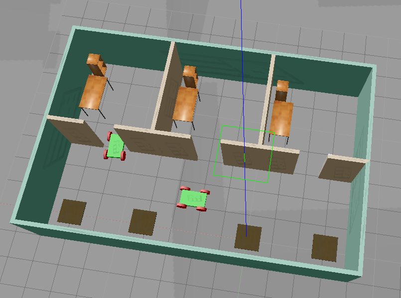

# My home service robot
TODO: Write a brief description. 

### The robot and its environment are simulated with gazebo.

## Important files and directories
- **Service_Robot_Simulation** : to simulate the robot in a environment using [Gazebo](http://gazebosim.org/).

## Installation and usage
TODO: Describe how can the software be installed and used?

## Licence
This project is licensed under the terms of the 
