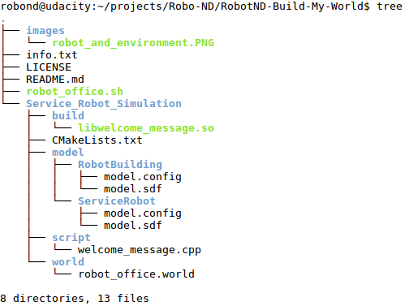

# Robotics: Build My World
Launch a robot world model with the tool [gazebo](http://gazebosim.org/). This model was also built with gazebo.

This project is part of my robotics nano degree of[ Udacity](https://www.udacity.com/course/robotics-software-engineer--nd209).

### The robot and its environment are simulated with gazebo.


## Important files and directories
- **Service_Robot_Simulation** : to simulate the robot in a environment using [Gazebo](http://gazebosim.org/).
  - CMakeLists.txt : the cmake configuration to build the the message library
  - script/welcome_message.cpp : the message script that print a message on start of gazebo
  - build/* : contains the message library build with cmake
  - world/robot_office.world : the world file is formatted using the Simulation Description Format or [SDF](http://sdformat.org/spec?ver=1.6&elem=world)
  - model/RobotBuilding/* : the building model
  - model/ServiceRobot/* : the robot model


### Project tree



## Installation and usage

Clone the repository
```sh
$ cd <your workspace folder>
$ git clone https://github.com/embmike/RobotND-Build-My-World.git
```

Bild message library
```sh
$ cd <your workspace folder>/RobotND-Build-My-World/Service_Robot_Simulation/build
$ cmake ../
$ make
```

Start the model with gazebo
```sh
$ cd <your workspace folder>/RobotND-Build-My-World/
$ chmod +x cd robot_office.sh
$ ./robot_office.sh
```


## Licence
This project is licensed under the terms of the [](https://opensource.org/licenses/MIT)

